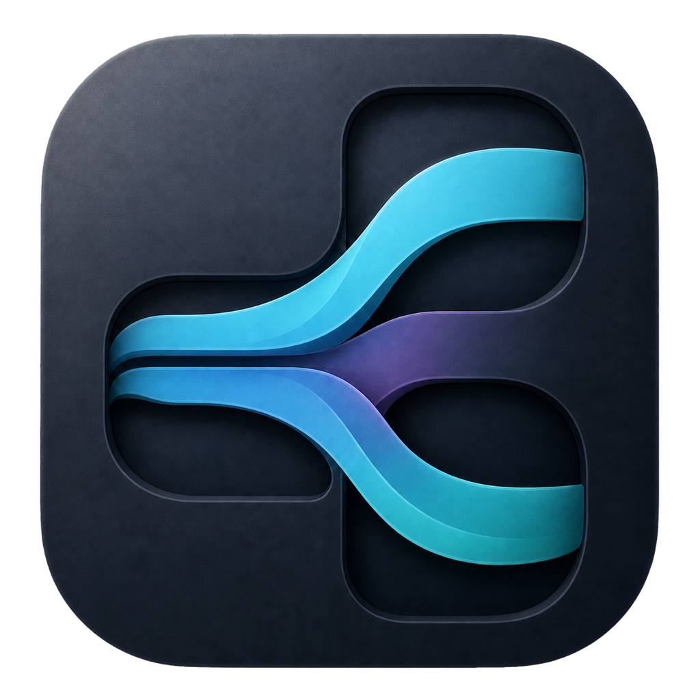

# Breath

<p align="center">
  
</p>

Breath 是一个使用 SwiftUI 和 libghostty 构建的 macOS 原生多 Agent
开发工作台。它以本地项目为边界，把工作区、并行工作会话、终端分屏、
Git 操作、Skills 和自动化任务集中在一个原生应用中。

## 主要能力

- 在一个工作区中创建多个工作会话，并递归进行横向或纵向终端分屏。
- 使用托管 Git Worktree 隔离需要并行修改同一仓库的 Agent 会话。
- 在原生终端中运行任意命令，并增强支持 Codex、Claude Code、
  Antigravity CLI、GitHub Copilot CLI、Qwen Code、Cursor Agent、
  Factory Droid、OpenCode、Pi 和 Kimi Code。
- 通过 Agent 官方 hooks 或 plugin 展示运行状态、标题与可恢复会话，
  不解析终端输出，也不保存 Prompt、回复或 transcript。
- 提供独立 Git 工作台、全局 Skill 管理和本地自动化任务。
- 自动化支持手动、单次、Interval、Cron 和本机短码触发，并以只读方式
  访问绑定项目。
- 所有工作区、会话和配置保存在本机；不需要 Breath 账户、后端或遥测。

## 系统要求

- macOS 14 Sonoma 或更高版本
- Xcode 与 Swift 6.2
- Zig 0.15
- Apple Metal Toolchain

安装 Ghostty 构建依赖：

```bash
brew install zig@0.15
xcodebuild -downloadComponent MetalToolchain
```

## 开发运行

首次运行前构建固定版本的 `GhosttyKit.xcframework`：

```bash
./scripts/build-libghostty.sh
```

然后编译、测试或启动开发版本：

```bash
swift build --product Breath
swift test
swift run Breath
```

`Vendor/GhosttyKit.xcframework` 是本地生成且不会提交到 Git 的产物。
缺少它时项目仍可编译，但终端区域只会显示构建提示。

## 一键打包

执行以下命令即可生成供本机使用的 Universal `.app` 和 `.zip`：

```bash
./scripts/build-app.sh
```

脚本会：

1. 检查本地是否已有 `GhosttyKit.xcframework`，缺少时自动构建。
2. 分别构建 arm64 与 x86_64 Release 可执行文件。
3. 合并 Universal Binary，复制 SwiftPM 资源、Sparkle 与应用图标。
4. 使用 ad-hoc 签名并关闭本地包的自动更新检查。
5. 覆盖同版本的旧本地构建，并将结果写入：

```text
dist/Breath-0.0.0.app
dist/Breath-0.0.0.zip
```

常用选项：

```bash
# 指定版本
./scripts/build-app.sh --version 0.1.0

# 重新构建 GhosttyKit
./scripts/build-app.sh --rebuild-ghostty

# 指定输出目录
./scripts/build-app.sh --output ./artifacts

# 打包完成后立即打开应用
./scripts/build-app.sh --open

# 查看全部选项
./scripts/build-app.sh --help
```

本地包使用 ad-hoc 签名，只适合当前 Mac 的开发验证。正式发布需要
Developer ID 签名、Apple 公证和有效的 Sparkle 密钥，具体流程见
[发布手册](docs/releasing.md)。

## 项目结构

```text
Sources/
├── BreathApp          SwiftUI/AppKit 应用外壳
├── BreathCore         领域模型与通用能力
├── BreathTerminal     libghostty 终端集成
├── BreathAgents       Agent 适配与生命周期事件
├── BreathAutomation   自动化调度与沙盒运行
├── BreathSkills       Skill 发现、安装与更新
├── BreathPersistence  GRDB 本地持久化
└── BreathUpdates      Sparkle 更新

Resources/             Info.plist 与应用图标
scripts/               开发、打包和发布脚本
docs/                  产品、架构与 ADR
Tests/                 Swift Testing 测试
```

产品与架构说明见
[Breath v1 产品与架构设计](docs/design/v1-product-and-architecture.md)。
