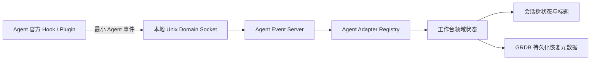
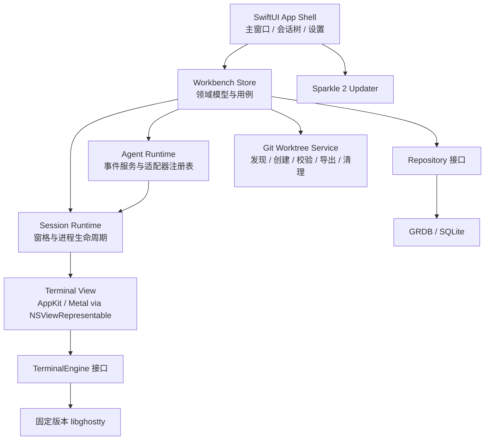

# Breath v1 产品与架构设计

状态：待最终确认  
日期：2026-07-14  
目标平台：macOS 14 Sonoma 及以上，arm64 与 x86_64 Universal Binary

## 1. 产品定义

Breath 是一个 macOS 原生多 Agent 工作台。它以本地项目目录为组织边界，让用户在多个工作会话和终端窗格中并行运行 Agent CLI，并通过 Agent 官方生命周期接口展示状态、标题和可恢复信息。

终端是 Breath 的通用交互核心，但 Breath 不是通用终端复用器。任何命令都可以在终端中运行；受支持的 Agent CLI 通过可选适配器获得增强能力。

### v1 范围

- 工作区、工作会话和终端窗格的树形组织。
- 单工作会话内横向、纵向及递归分屏。
- 基于 libghostty 的原生终端。
- Agent 生命周期状态、原生标题、原生会话标识和自动恢复。
- 工作会话可明确选择使用 Breath 托管的 Git worktree，在同一仓库中隔离并行 Agent 修改。
- 工作会话归档、恢复和永久删除。
- 正常退出、更新重启和冷启动恢复。
- 两类样式配置：应用配置与终端配置。
- 本地持久化、站外签名发行和应用内更新。

### v1 不包含

- 自动化、普通聊天和 Computer Use 等后续能力。
- Breath 账户、后端、云同步或遥测。
- Mac App Store、App Sandbox 或 Electron/WebView 技术栈。
- 终端滚动历史跨退出或归档持久化。
- Ghostty 配置导入、读取或同步。
- 手动修改工作会话或终端窗格名称。
- macOS 系统通知。
- 崩溃或强制退出后的进程存活保证。

## 2. 信息架构

主窗口只有一个，最左侧固定一列活动栏，图标从上到下依次为“工作区、任务、Git、Skills、设置”。选择“工作区”时，活动栏右侧采用会话树与终端区域的分栏：

```text
工作区（本地目录）
└── 工作会话
    └── 终端窗格（仅产生分屏后显示）

终端区域
├── 工作会话 Tab · 工作会话 Tab · 新建
└── 当前工作会话的递归分屏布局
```

- 同一规范化目录只能添加为一个工作区。
- 一个工作区可包含多个工作会话。
- 当前工作区的全部活跃工作会话在终端区域顶部以浏览器式 Tab 并列展示；Tab 横向溢出时滚动。
- 选择工作会话 Tab 只替换其下方内容，当前工作会话内部仍使用原有递归分屏布局。
- Tab 的关闭动作等同于归档；关闭当前 Tab 时选择同工作区的右侧相邻 Tab，没有右侧项时选择左侧相邻 Tab。
- 新建工作会话时创建一个终端窗格。
- 普通新建默认创建本地会话；工作区菜单可以明确创建工作树会话。
- 一个工作会话只使用一个会话工作目录；同一会话内的全部终端窗格共享该目录。
- 单窗格时，会话树只展示到工作会话，并由工作会话节点承载窗格状态。
- 多窗格时展示第三级；状态只显示在终端窗格节点，父工作会话不做状态汇总。
- 已归档工作会话不出现在会话树，只能在主窗口右侧设置页面的“已归档”管理页查看。

选择任务、Git、Skills 或设置时，不展示工作区会话树，对应页面直接占满活动栏右侧区域；再次选择“工作区”才恢复会话树与终端区域。工作区标题栏以及全局页面自身的 Tab 或顶部栏贴合窗口顶部，使用统一的紧凑高度、标题层级和左右边距；栏内内容在水平方向避开 macOS 窗口按钮，不额外保留空白标题行。

Git 工作台的分支导航区分本地分支与远程跟踪分支。本地分支默认展开并作为主要操作列表；远程分支独立分组且默认收起，搜索远程分支时自动展示匹配结果。远端默认分支的 `HEAD` 符号引用不进入列表，也不能触发 Checkout 或创建本地分支。单击分支行只更新选中状态，双击或显式选择 `Checkout` 才执行分支切换。若 Checkout 会覆盖本地修改，界面列出受影响文件并提供 Smart Checkout、Force Checkout 和取消；Smart Checkout 临时 Stash 并在切换后恢复修改，Force Checkout 丢弃修改，两条路径都先创建 Git 安全快照。

工作区目录不可用时保留记录并提示移除，不提供重新定位。确认移除后，Breath 停止相关进程并永久删除该工作区的 Breath 元数据，不修改目录中的项目文件。

## 3. 工作会话与终端行为

### 3.1 创建

- 新工作会话总是从空终端开始，不自动启动任何 Agent。
- 本地会话的默认工作目录是工作区根目录；工作树会话使用其专属托管工作树中的对应工作区目录。
- Shell 使用用户默认 Shell，并作为交互式 login shell 启动，以继承用户的 PATH、启动配置和开发工具环境。
- Breath 只额外注入工作区、工作会话、终端窗格及当前应用实例的关联变量。

### 3.2 分屏

- 当前窗格可执行横向或纵向分屏。
- 任意窗格可继续分屏，形成递归二叉布局树。
- 新分屏默认 50/50，分隔线可拖动。
- 布局方向、节点关系和各层比例持久化。
- 新窗格始终在会话工作目录启动新的空 Shell，不继承源窗格的 cwd、进程、环境增量或 Agent 对话。
- 各窗格之间没有运行时关联。

### 3.3 关闭

- 多窗格时可以关闭单个窗格；关闭会停止该窗格进程，存在前台工作时先确认。
- 最后一个窗格不能单独关闭，用户应归档整个工作会话。
- 切换到其他工作会话不会暂停或终止已实例化会话中的进程。

## 4. 名称与状态

### 4.1 名称

- Breath 不读取原始对话、不解析终端输出，也不调用额外模型生成名称。
- 工作会话获得的第一个 Agent 原生标题成为父节点名称，之后不自动换成其他 Agent 的标题。
- 分屏存在时，各终端窗格显示各自当前绑定 Agent 的原生标题。
- 所有名称都不允许手动修改。
- 原生标题出现前，工作会话使用 `新会话 · HH:mm`，窗格使用 `终端 1`、`终端 2` 等占位名称。
- Agent 未通过官方接口提供标题时，继续使用占位名称。

### 4.2 状态

终端状态只有四种：

| 状态 | 含义 |
|---|---|
| 空闲 | 普通 Shell、Agent 已退出、尚未运行 Agent 或 Agent 恢复失败 |
| 运行中 | 当前 Agent 回合正在执行 |
| 需要处理 | Agent 通过官方事件表示需要用户许可或输入 |
| 回合完成 | 当前回合已经结束，Agent CLI 仍可等待下一条指令 |

Agent 类型是独立展示信息，不增加新的终端状态。状态变化只更新会话树，不触发系统通知。每个 Agent 适配器负责把其官方事件映射到这四种状态。

## 5. Agent 集成

### 5.1 通用终端与增强边界

- 用户必须自己在空终端中输入 Agent CLI 命令。
- 未支持或未启用集成的 Agent CLI 仍可正常运行，但 Breath 把它视为普通终端程序。
- Breath 不通过命令名称或终端输出猜测 Agent 状态。

### 5.2 首版支持矩阵

- Codex
- Claude Code
- Gemini CLI
- GitHub Copilot CLI
- Qwen Code
- Cursor Agent
- Factory Droid
- OpenCode
- Pi

进入支持矩阵意味着：Agent 拥有官方、稳定的本地生命周期扩展机制，Breath 具有明确的最低兼容版本、内置适配器和兼容性测试。官方接口没有提供标题或恢复能力时，分别使用占位标题或只恢复布局。

### 5.3 安装方式

- Agent 集成按 Agent 分别启用，只有用户明确操作后才安装。
- hooks 或 plugin 写入用户级配置，不修改项目目录。
- 安装时合并已有配置而不覆盖，修改前备份，并向用户展示目标文件。
- 卸载只移除 Breath 管理的配置片段，保留用户的其他配置。
- Breath 未运行、关联变量缺失或本地通道不可连接时，集成静默结束，不影响 Agent CLI。

“Agent 集成”和“已归档”属于设置页面中的管理页，不属于应用配置或终端配置。

主窗口右侧设置页面在顶部显示固定的“设置”标题和紧凑 Tab；Tab 的视觉高度小于顶部栏并保留上下间距，超出可用宽度时横向滚动。设置内容始终从分隔线下方开始，不与导航重叠。各 Tab 的子页面统一采用与“Agent 集成”相同的原生列表容器、内容边距和行间距；Git、快捷键等信息较多的页面保留 Section 分组层级。配置行的控件统一放在右侧固定宽度的控件列中，使不同 Tab 的控件左右边界保持一致；步进器的数值与按钮在该列内排列，开关统一贴齐控件列右边界。Git 可执行文件等复合控件可以使用更宽的控件列，但仍保持相同的右边界。

### 5.4 事件通道



- Breath 为每个终端窗格注入稳定的工作区、工作会话和窗格 ID。
- hooks 继承这些变量，并通过当前用户可访问的 Unix Domain Socket 发送事件。
- 事件仅包含 Agent 类型与版本、事件类型与时间、官方会话标识、官方标题、cwd 和 Breath 关联 ID。
- 不传输或保存提示词、回复、工具输入输出、transcript 内容或 transcript 路径。

### 5.5 窗格绑定

- 一个终端窗格最多绑定一个可自动恢复的 Agent 对话。
- 在同一窗格启动新的受支持 Agent 对话时，新绑定替换旧绑定。
- 状态、窗格标题、会话标识和自动恢复都跟随新绑定。
- 旧 Agent 对话仍由原 CLI 保存，但 Breath 不再自动恢复它。
- 需要同时保留多个自动恢复目标时，用户应创建分屏或新的工作会话。

## 6. 生命周期与恢复

### 6.1 关闭主窗口

- 关闭唯一主窗口不退出 Breath。
- 应用及已经实例化的终端进程继续在后台运行。
- 重新打开主窗口时显示原有运行状态；此过程不是持久化恢复。

### 6.2 正常完全退出

- `⌘Q` 始终弹出二次确认。
- 用户取消时不改变任何进程。
- 用户确认后，Breath 先保存工作会话、递归布局、Agent 会话标识、当前绑定和退出前是否仍在运行，再停止全部终端进程并退出。
- 不保存终端滚动历史。
- 崩溃或强制退出不承诺保存最新恢复标记，也不承诺进程存活。

### 6.3 冷启动与按需实例化

- Breath 记住正常退出前选中的工作会话。
- 下次启动只处理该工作会话的全部终端窗格。
- 退出前仍在运行且具有可用恢复信息的 Agent 自动续接；普通 Shell、已退出 Agent、未支持 Agent 和恢复失败的窗格打开为空 Shell。
- 其他工作会话只恢复到会话树，不创建 Shell 或 Agent；用户第一次选中时再按相同规则处理。
- 工作会话一旦实例化，之后切走仍继续运行。
- 上次选中的会话已归档、已删除或工作区不可用时，不自动选择其他会话，也不创建终端。

### 6.4 归档

- 回合完成不会自动归档。
- 用户点击工作会话旁的归档按钮才会归档。
- 归档停止该工作会话中的全部终端进程；存在 Agent 回合或其他前台进程时先确认。
- 归档保留布局、标题、当前 Agent 绑定及可恢复会话标识。
- 工作树会话归档时保留其托管工作树；永久删除时按代码风险检查规则删除工作树。
- 在“设置 → 已归档”点击恢复，只把原工作会话放回活跃会话树；设置页面保持打开，当前工作会话选择不变，也不创建进程。
- 用户之后选中恢复的会话时，才按保存信息恢复。
- 永久删除归档需要二次确认，只删除 Breath 元数据，不删除项目文件或 Agent CLI 数据。

### 6.5 应用更新

- Sparkle 自动检查更新，但不静默强制安装。
- 用户确认“安装并重启”后，更新流程复用正常退出的保存与停止规则。
- 重启后仍只立即处理更新前选中的工作会话，其他会话按需实例化。
- 用户取消安装时不终止进程。

## 7. 配置与管理页面

Breath 只有两类配置，并且两者都只负责样式：

- **应用配置**：只负责终端之外应用界面的样式。
- **终端配置**：只负责终端内部样式，例如字体、字号、颜色主题和光标。

Shell、快捷键、分屏和 Agent 行为不属于这两类配置。Breath 不读取、导入或同步 Ghostty 配置。

快捷键按当前输入焦点链式仲裁：焦点位于终端窗格时，可能冲突的按键先交给窗格内运行的 Shell、Agent CLI 或其他 TUI；当窗格内应用启用了可表示该组合键的终端键盘协议，且按键成功送入子进程时视为已处理，否则同一个按键再由 Breath 处理。Ghostty 自身的窗口、Tab、分屏等宿主级动作不参与此优先级，Breath 生成内部 Ghostty 配置时取消与自身快捷键冲突的内建绑定。焦点不在终端时由 Breath 直接处理；窗格级快捷键作用于当前或最后聚焦的终端窗格。

PTY 键盘协议不提供“应用内部是否绑定了当前组合键”的逐键回执，因此终端侧的可观测仲裁边界是窗格内应用选择启用该协议并成功接收按键，而不是 Ghostty 是否存在同名宿主动作。

- `⌘1…⌘9` 分别选择当前工作区的第 1 至第 9 个工作会话 Tab；前九个 Tab 始终显示对应快捷键提示，未获得 Agent 原生标题时只显示不带时间的“新会话”。
- `⌘[` 循环聚焦当前工作会话中的上一个分屏。
- `⌘]` 循环聚焦当前工作会话中的下一个分屏。
- `⌘T` 创建新的工作会话；数字快捷键不再用于分屏选择。

设置页面还可以包含“Agent 集成”和“已归档”等管理页；它们是操作入口，不是第三类配置。

## 8. 技术架构



### 8.1 模块边界

| 模块 | 职责 |
|---|---|
| App Shell | SwiftUI 场景、单窗口、菜单、设置和导航 |
| Workbench Domain | Workspace、Work Session、Terminal Pane、Split Tree、Archive 等领域规则 |
| Session Runtime | 按需实例化、PTY/进程所有权、切换、停止、退出与恢复协调 |
| Terminal View | 输入法、键盘、鼠标、选择、渲染、分隔线和焦点 |
| TerminalEngine | 隔离 libghostty 的不稳定嵌入 API，向上暴露窄接口 |
| Agent Runtime | 本地 Socket、事件校验、适配器、状态映射、标题与恢复命令 |
| Persistence | GRDB migrations、事务、仓储实现和启动恢复快照 |
| Git Worktree Service | 仓库发现、同仓库操作串行、托管工作树生命周期、分支导出、删除风险检查与启动对账 |
| Updater | Sparkle 检查、确认、签名验证及重启协调 |

SwiftUI 视图只依赖领域模型和用例，不直接访问 GRDB 记录或 libghostty API。libghostty 固定在验证过的源码 revision，并通过 TerminalEngine 接口隔离，cmux 只作为技术参考。

### 8.2 本地数据

SQLite 至少保存：

- 工作区 ID、规范化路径、展示信息和排序。
- 工作会话 ID、工作区 ID、标题来源、归档状态、创建与最近活动时间。
- 会话目录类型，以及托管工作树的路径、仓库关联、创建基线、工作区相对路径、最近导出分支和清理状态。
- 带稳定窗格 ID 的版本化递归分屏树、方向和比例。
- 终端窗格当前 Agent 类型、原生标题、原生会话标识和恢复标记。
- 正常退出快照、最后选中的工作会话和 schema 版本。
- 应用配置与终端配置的样式值。

不保存终端输出、滚动历史、Agent 对话内容、工作树 diff、文件名列表、提交消息或凭据。v1 不使用 SQLCipher；数据库位于当前用户的应用数据目录并限制文件权限，依赖 macOS/FileVault。未来若保存凭据或原始内容，必须改用 Keychain 或字段级加密并设计迁移。

## 9. 发行与更新

- 使用 Developer ID 签名和 Apple 公证，不启用 App Sandbox。
- 产物是 macOS 14+ 的 arm64/x86_64 Universal Binary。
- GitHub Actions 执行构建、测试、签名、公证和发布。
- 公开 GitHub Releases 托管安装包与 Sparkle 更新包。
- 同仓库 GitHub Pages 托管签名后的 appcast。
- Sparkle 同时验证 Apple Code Signing 与 EdDSA 签名。
- 客户端不需要 GitHub 登录、Token 或 Breath 后端。

## 10. 验收标准

1. 用户可以添加唯一工作区，并在其中创建多个空终端工作会话。
2. 会话树严格遵守单窗格两级、多窗格三级以及不汇总父状态的规则；同工作区活跃会话同时出现在可滚动的工作会话标签栏中。
3. `⌘1…⌘9` 可按编号切换工作会话 Tab，`⌘T` 可新建工作会话，`⌘[` 与 `⌘]` 可循环切换当前会话的相邻分屏。
4. 横向、纵向和递归分屏可创建、调整、持久化并正确恢复。
5. 新会话与新分屏均在工作区根目录启动独立 login shell。
6. 关闭主窗口后 Agent 继续运行；重新打开窗口可继续交互。
7. `⌘Q` 确认后停止所有进程并保存恢复信息；再次启动只立即处理退出前选中的工作会话。
8. 切换到尚未实例化的会话时才创建其终端；切走后进程继续运行。
9. 归档停止全部相关进程并从会话树消失；设置页面可以恢复或永久删除。
10. 九个首版 Agent 的兼容测试可以驱动四态变化，并在官方能力存在时捕获标题、会话标识和执行恢复。
11. 未支持 Agent 和普通命令不受 Agent 集成影响。
12. Hook 事件不包含提示词、回复、工具内容或 transcript。
13. 应用配置和终端配置只改变各自范围内的样式，不改变行为，也不读取 Ghostty 配置。
14. 签名、公证后的 GitHub Release 可以被 Sparkle 发现、验证并在用户确认后安装。
15. 用户可以从工作区菜单创建专属托管工作树会话；其全部窗格和 Git 工具都使用该工作树。
16. 工作树创建、归档、恢复、分支导出、风险删除、工作区移除和崩溃后对账符合 [`managed-worktree-sessions.md`](managed-worktree-sessions.md)。

## 11. 实施前技术验证

以下是实现风险，不是待定产品决策：

1. 先完成 libghostty 的最小嵌入验证：PTY、Metal/AppKit 渲染、中文输入法、窗口缩放、复制粘贴和 Universal Binary 链接。
2. 为九个 Agent 分别制作能力表和契约测试，验证最低版本、事件名称、会话标识、官方标题与恢复命令；缺失能力必须走既定降级路径。
3. 验证用户级 hooks/plugin 的可逆合并、备份、冲突检测和静默失效。
4. 验证正常退出快照的事务性，避免进程已停止但恢复标记未保存。
5. 验证 Sparkle、libghostty 和 hook helper 一起签名、公证后的完整发布产物。
6. 验证 `/usr/bin/git` 2.20+ 下的 worktree 创建与清理，尤其是 hooks、filters、LFS、锁文件、linked worktree、路径越界和崩溃恢复边界。

## 12. 决策记录

详细取舍见 [`docs/adr`](../adr/)；领域术语和禁止混用的名称见 [`CONTEXT.md`](../../CONTEXT.md)。

主要外部依据：

- [Ghostty](https://github.com/ghostty-org/ghostty)
- [Sparkle 2](https://sparkle-project.org/documentation/)
- [GitHub Releases](https://docs.github.com/en/repositories/releasing-projects-on-github/about-releases)
- [GitHub Pages](https://docs.github.com/en/pages/getting-started-with-github-pages/creating-a-github-pages-site)
- [GRDB.swift](https://github.com/groue/GRDB.swift)
- [Apple：Distributing software on macOS](https://developer.apple.com/macos/distribution/)
